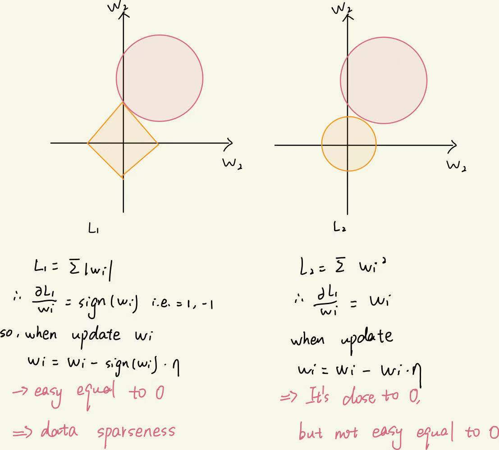

Course 2-Week 1
=========

## 1 Regularization
### 1.1 Purpose
In order to avoid the over-fitting, we have two method to do, one is adding more data, another is regularization.  

### 1.2 Why regularization reduces over-fitting?
The intuitive understanding is that if the regularization λ is set large enough, the weight matrix W is set to a value close to 0. We try to eliminate or at least reduce the influence of many hidden units and eventually the network becomes simpler, the neural network gets closer and closer to logistic regression, we intuitively think that a large number of hidden units are completely eliminated, but in fact they are not, in fact all the hidden units of the neural network are still there, but their influence becomes smaller. The neural network becomes simpler and seems to be less prone to overfitting. 

### 1.3 L1 & L2 Norm
L1 Norm is easy to cause the data sparseness.\
Actually, "the regularizaton" is equal to "with constraints".\
The picture as following, it's the L1 & L2's solution space.\



### 1.4 Dropout
In order to reduce the complexity of the model, the nodes of each layer are deleted randomly.\
It can improve the over-fitting. 

eg.
```python
import pandas as pd
keep_prob = 0.8
# w1 is the layer's parameter
d1 = np.random.rand(w1.shape[0], w1.shape[1])
d1 = keep_prob < 0.8
w1 *= d1
w1 /= keep_prob
```

### 1.5 Others

* Data augmentation  
For example, images can be reversed or distorted to increase training data.

* early stopping 
you only try one time, you can find the mid-size w between small and large w, if you use L2 norm, you should try many many times.
But when you use early stopping, the J(w, b)--loss function maybe is larger than expection, so it's the shorcoming of the early stopping.

## 2 Normalizing inputs
It can speed up the training, because after normalization, it will be the same speed which direction you start from.

## 3 Initialization
### 3.1 all zeros
In general, zero initialization will lead to the inability of the neural network to break the symmetry. The final result is that no matter how many layers the network has, it can only get the same effect as the Logistic function.
### 3.2 random
We can see that the error starts to get very high.This is because the output of the last activation (sigmoid) is very close to 0 or 1 due to its large random weight, and it causes very high losses when it goes wrong.Inproperly initialized parameters can cause gradients to disappear and explode, which can also slow down the optimization algorithm.If we had trained the network for a longer period of time, we would have seen better results, but initialization with too large a random number would have slowed down the optimization.
So in general, initializing weights to be very large doesn't really work very well.
### 3.3 add a formula
When initialize a W, we can time a formula:\
if the active is Relu, the formula is  $np.sqrt( \frac {2} {n^{[l-1]}} )$ 

if the active is tanh, the formula is  $\sqrt( \frac {2} {n^{[l-1]}})$ 

## 4 Gradient checking

$$d\theta_{approx}[i] = \frac {J(\theta_1, theta_2, theta_3 + \epsilon, ...) - J(\theta_1, theta_2, theta_3 - \epsilon, ...)} {2\epsilon}$$  

checking following:
$$\frac{||d\theta_{approx}-d\theta||_2}{||d\theta_{approx}||_2+||d\theta||_2}$$  
