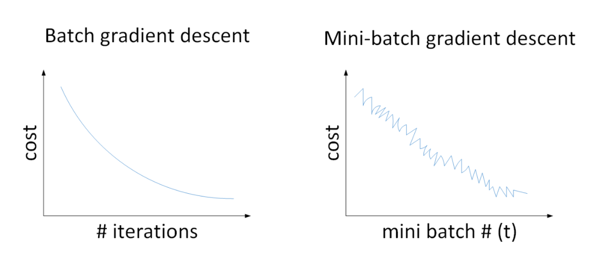

Course 2-Week 2
=========

## Optimization algorithm
### 1 Mini-batch gradient descent
Divide the data into m data to be trained in turn.

For a general neural network model, using Batch gradient descent, the cost is decreasing as the number of iterations increases. However, with Mini-batch gradient descent, instead of a monotonic decrease in cost as training is iterated over different mini-batches, the cost oscillates, subject to a noise-like effect. However, the overall trend is decreasing, and eventually a lower cost value is obtained.  

  

The reason for the subtle oscillations is that there are differences between the different mini-batches. For example, the first subset ($X^1,Y^1$) may be a good subset, while the second subset ($X^2,Y^2$) contains some noisy noises.

In general, if the overall sample size m is not too large, e.g. m ≤ 2000, it is recommended to use Batch gradient descent. if the overall sample size m is large, it is recommended to divide the sample into many mini-batches. the recommended mini-batch sizes are 64, 128, 256, 512. are all powers of 2. The reason for this is that computers generally store data to the power of 2 and this will increase the speed of computing.

### 2 exponentially_weighted_averages

#### 2.2 Exponentially weighted averages
The formular is
$$V_t = \beta V_{t-1} + (1- \beta)$$
and the $\beta$ determines the number of days of the weighted average, the day is:
$$\frac{1}{1-\beta}$$

But, there is a problem:

We notice that the difference between the purple curve and the green curve is that the purple curve starts off relatively lower. This is because we set $V_0$=0 at the beginning, so the initial value is relatively small until it tapers off and becomes normalised by the preceding effects.

The way to correct for this is to apply a bias correction, i.e. after each calculation of $V_t$, the following equation is applied to $V_t$:
$$\frac{V_t}{1 - \beta^t}$$

At the beginning, t is relatively small, (1 - $β^t$) < 1, which corrects VtVt a little more, with the effect of lifting the beginning part of the purple curve upwards a little to nearly coincide with the green curve. As t increases, (1 - $β^t$) ≈ 1, Vt remains essentially unchanged and the purple curve still coincides with the green curve. This achieves a simple offset correction and gives us the green curve we want.

It is worth mentioning that the offset correction is not necessary in machine learning. This is because, after one iteration (with a large t), $V_t$ is minimally affected by the initial value and the purple curve largely coincides with the green curve. Therefore, it is generally possible to ignore the initial iteration process and wait until after a certain number of iterations before taking the values, so that no offset correction is needed.

### 3 Gradient descent with momentum
$$V_{dW} = \beta V_{dW} + (1-\beta)dW$$
$$V_{db} = \beta V_{db} + (1-\beta)db$$
$$W = W - \alpha V_{dW}$$
$$b = b - \alpha V_{db}$$

Initially, let V_{dW}=0,V_{db}=0. Generally set $\beta$=0.9, i.e. the data of the first 10 days of the index weighted average, which is better for practical application.

### 4 RMSprop

### 5 Adam

Adam's algorithm contains several hyperparameters, namely: $\alpha,\beta_1,\beta_2, \epsilon$. where $\beta_1$ is usually set to 0.9, $\beta_2$ is usually set to 0.999 and $\epsilon$ is usually set to 10-8. generally only $\beta_1$ and $β_2$ need to be debugged.

### 6 Learning rate decay
Decreasing the learning factor $\alpha$ is also effective in increasing the training speed of a neural network, a method known as learning rate decay.

Learning rate decay means that the learning factor $\alpha$ decreases as the number of iterations increases. The benefits of this are illustrated in the following diagram. In the diagram below, the blue dash indicates the use of a constant learning factor $\alpha$. As $\alpha$ is the same for each training, the step length remains the same and the oscillations are larger near the optimum, oscillating over a larger range around the optimum and further away from the optimum. The green dash indicates the use of decreasing $\alpha$, where $\alpha$ decreases as the number of training sessions increases and the step length decreases, allowing for a smaller range of weak oscillations at the optimum, constantly approaching the optimum. The learning rate decay is closer to the optimum than a constant $\alpha$.

### 7 The problem of local optima

Both RMSProp and Adam algorithms can effectively solve the problem of too slow descent of *Plateaus* and greatly improve the learning speed of neural network.
* Plateaus may slow down gradient descent, slowing down learning