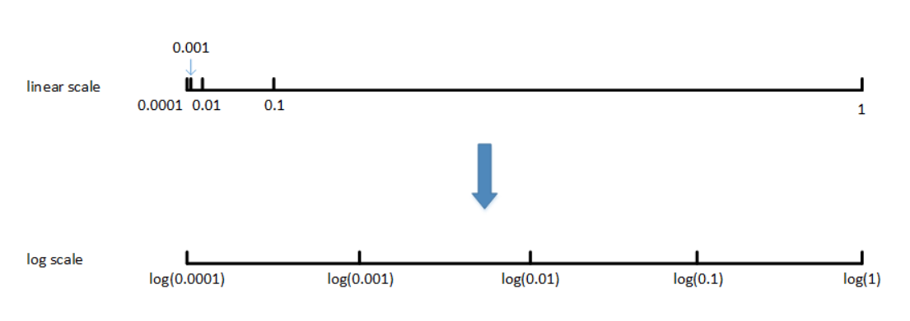

Course 2-Week 3
=========

## 1. systematically organize your hyperparameter search process
* 1.use random sampling and adequate search and consider implemeting a coarse to fine serch process
* 2.use an appropriate scale to pick hyperparameters

For example, for hyperparameters #layers and #hidden units, which are positive integers, it is possible to do uniform random sampling, i.e. the hyperparameters change at the same scale each time (e.g. each change is 1, as if a scale were uniform).

However, for some hyperparameters, non-uniform random sampling (i.e. non-uniform scales) may be required. For example, the hyperparameter $\alpha$ has a range to be tuned of [0.0001, 1]. If uniform random sampling is used, then 90% of the sampling points are distributed between [0.1, 1] and only 10% are distributed between [0.0001, 0.1]. This is not good in practice, as the best $\alpha$ values are likely to be distributed mainly between [0.0001, 0.1], while the $\alpha$ values in the range [0.1, 1] do not work well. We are therefore more concerned with the interval [0.0001, 0.1] and should subdivide more scales within this interval.

The usual practice is to convert linear scale to log scale, convert uniform scale to non-uniform scale, and then to sample uniformly under log scale. In this way, the number of randomly sampled hyperparameters in the intervals [0.0001, 0.001], [0.001, 0.01], [0.01, 0.1], [0.1, 1] is essentially the same, which also expands the number of values sampled in the previous interval [0.0001, 0.1].


python demo:
```python
m = np.log10(a)
n = np.log10(b)
r = np.random.rand()
r = m + (n-m)*r
r = np.power(10,r)
```

In addition to $\alpha$, the same applies to the momentum gradient factor $\beta$, which also needs to be sampled non-uniformly during hyperparameter debugging. Generally $\beta$ takes values in the range [0.9, 0.999], then $1-\beta$ takes values in the range [0.001, 0.1]. Then it is straightforward to log transform $1-\beta$ in the interval [0.001, 0.1].

Here is an explanation of why $\beta$ also needs to be non-uniformly sampled like $\alpha$. Suppose $\beta$ changes from 0.9000 to 0.9005, then $\frac{1}{1-\beta}$ is essentially unchanged. But suppose that $\beta$ changes from 0.9990 to 0.9995, then $\frac{1}{1-\beta}$ differs by 1000 before and after. the closer $\beta$ is to 1, the greater the number of exponentially weighted averages and the greater the change. So for intervals where $\beta$ is close to 1, the collection should be more intensive.

* Hyperparameters tuning in practice: Pandas vs. Caviar

It depends on your computer performance.
__pandas:__
When training a deep neural network, in one case we can only train one model and tune different hyperparameters to make the model perform best due to the limitation of computing performance. 
__Caviar:__
Another scenario is that we can train many models in parallel, debugging different hyperparameters on each model and selecting the best model based on its performance. This is called training many models in parallel.

## 2. other information
* Normalizing activations in a network

$$Z^{l} - Z^{l}_{norm} - Z^{l}_{trial} - A^{l}$$

* Softmax
When number of class is 2, it's similar to sigmoid.