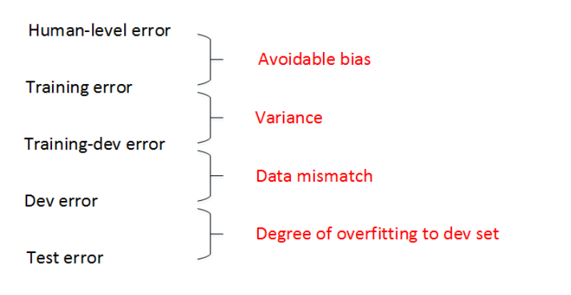

Course 3-Week 2
=========

## 1 Carrying out error analysis
It's very important for us to establish the error analysis of models.
For example, we can analysis the wrong data, and find the category with most errors. Then we can focus on optimising this category.

## 2 Cleaning up incorrectly labeled data
Firsly, we should find the reason to cause the incorrectly labeled data, random errors or systematic errors.  
If it's systematic errors, it will have a bad effect on the model.  

How can we identify them?  
We can carry out the error analysis!  

## 3  Build your first system quickly then iterate

* Set up dev/test set and metric
* Build initial system quickly
* Use Bias/Variance analysis & Error analysis to prioritize next steps

## 4 Training and testing on different distribution
Combine the original train set and part of the dev/test set as a train set, and the remaining dev/test set as a dev set and a test set respectively.  
For example, 200,000 webpages and 5,000 mobile app images are combined into a train set, the remaining 2,500 mobile app images are used as the dev set and 2,500 mobile app images are used as the test set. This ensures that the validation set is closest to the actual application. This approach is more commonly used and has a better performance.

## 5 Bias and Variance with mismatched data distributions
By comparing the following error, to idetify the reason to cause the error.

## 6 Addressing data mismatch
