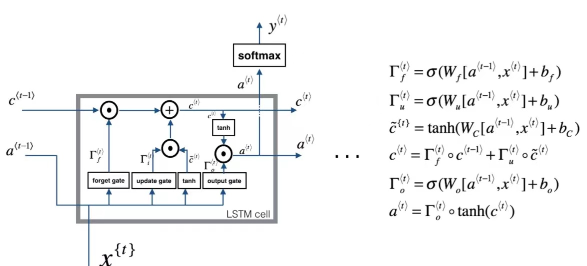

Course 5-Week 1
=========

## 1 LSTM(Long Short-Term Memory)

### 1.1 forget gate
$$\Gamma^{(t)}_f = \sigma(W_f[a^{(t-1)}, x^{(t)}]+b_f)$$

$\Gamma^{(t)}_f$ is [0, 1];\
When $\Gamma^{(t)}_f$ is equal 0 (or $\approx$ 0), the information will be delete all;\
When $\Gamma^{(t)}_f$ is equal 1 (or $\approx$ 1), the information will be kept in full.

### 1.2 update gate
$$\Gamma^{(t)}_u = \sigma(W_u[a^{(t-1)}, x^{(t)}]+b_u)$$
It's similar to forget gate, the range is between 0 and 1.\

### 1.3 tanh(update unit)
$$c^{\sim(t)}_u = \sigma(W_u[a^{(t-1)}, x^{(t)}]+b_u)$$

### 1.4 output gate

